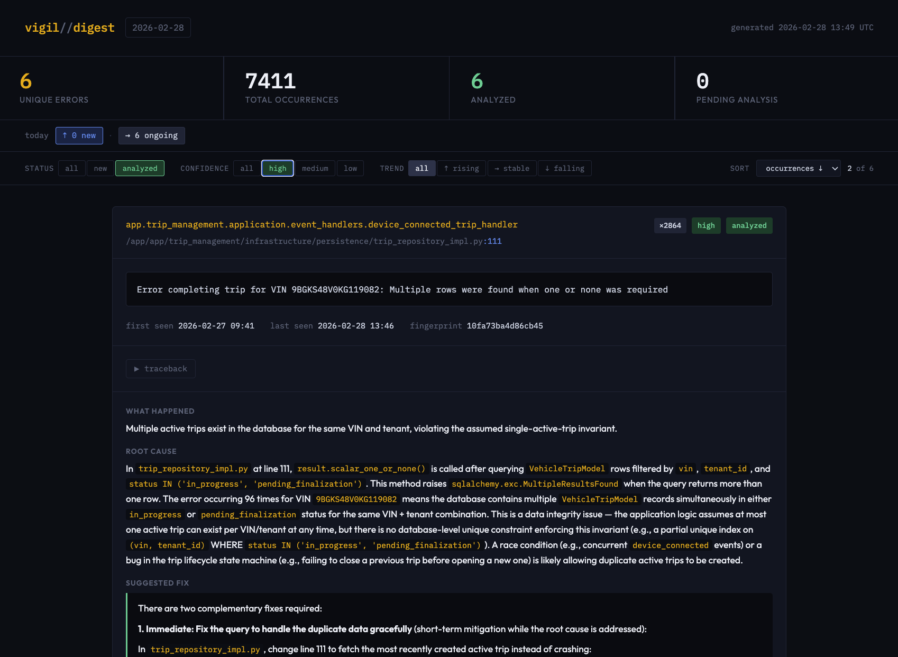
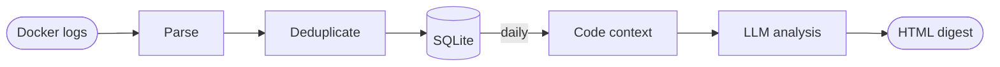

# Vigil

> Watches your backend so you don't have to.

I built Vigil because I don't have much time to work on side projects, and I needed a way to keep an eye on the errors my API is throwing without having to sweep through Docker logs every morning. I wanted something that would just tell me what broke, why, and how to fix it — without signing up for another SaaS.

Vigil runs alongside your production Docker stack. Every hour it collects your container logs, extracts and deduplicates errors, and at midnight delivers an HTML digest with LLM-powered root cause analysis and fix suggestions for every unique error it found.

I put this together in ~4 hours with Claude Sonnet. It's running in my own production environment. It's not battle-tested at scale, but it works, and I'm actively improving it.



## How it works



- **Hourly**: Collects the last hour of logs from a Docker Compose service, parses multiline entries (tracebacks included), deduplicates errors by fingerprint, and persists them with occurrence counts and timestamps. Re-renders today's report so you always have an up-to-date view.
- **Daily**: Runs LLM analysis on new unique errors — reading the relevant source files for context — and renders a styled HTML report with root cause analysis, fix suggestions, error trends, and a diff of what's new vs. resolved since yesterday.
- **Lifecycle tracking**: Each error has a status (`new` → `analyzed` → `inactive`). Errors not seen in 48 hours are automatically marked inactive. If they reappear, they're re-queued for analysis.

## Stack

- **Python 3.11+** with [uv](https://github.com/astral-sh/uv) for dependency management
- **SQLModel** (SQLite) for persistence — no database to set up
- **Anthropic Claude API** for root cause analysis ([Ollama](https://ollama.com/) also supported for local/free usage)
- **Jinja2** for HTML report rendering
- Scheduled via cron — no extra infrastructure

## Project structure

```
vigil/
├── analyzer/
│   ├── collector.py       # docker compose logs → raw text
│   ├── parser.py          # raw text → LogEvent dataclasses
│   ├── deduplicator.py    # fingerprinting + normalization
│   ├── code_reader.py     # traceback path → source code context
│   └── state_manager.py   # hourly stat writes + inactive transitions
├── integrations/
│   └── github.py          # GitHub API — open/fetch issues, build issue body
├── llm/
│   ├── base.py            # abstract LLMProvider interface
│   ├── claude.py          # Anthropic implementation (tool use)
│   └── ollama.py          # Ollama implementation
├── storage/
│   ├── models.py          # SQLModel tables + dataclasses
│   └── db.py              # database access layer
├── reporting/
│   ├── renderer.py        # Jinja2 → HTML report
│   └── templates/
│       ├── digest.html    # daily report template
│       └── index.html     # report archive index
├── reports/               # generated reports (YYYY-MM-DD.html)
├── cli.py                 # terminal interface (vigil errors / vigil error / vigil github)
├── config.py              # pydantic-settings, .env-driven
├── hourly.py              # cron entry: collect → parse → dedup → persist → render
└── digest.py              # cron entry: analyze → render report
```

## Setup

**Requirements**: Python 3.11+, [uv](https://github.com/astral-sh/uv), Docker Compose v2, access to the target service's compose file and source code on the same host.

```bash
git clone https://github.com/rsorage/vigil
cd vigil
cp .env.example .env
# Edit .env — at minimum set ANTHROPIC_API_KEY, DOCKER_COMPOSE_FILE,
# DOCKER_SERVICE_NAME, APP_SOURCE_PATH
uv sync
mkdir -p logs
```

Run a quick sanity check before setting up cron:

```bash
uv run python hourly.py    # parses logs and writes reports/YYYY-MM-DD.html
uv run python digest.py    # analyzes new errors — uses API credits
```

## Configuration

All configuration is via `.env`. Copy `.env.example` to get started.

| Variable | Description | Default |
|---|---|---|
| `LLM_PROVIDER` | `claude` or `ollama` | `claude` |
| `ANTHROPIC_API_KEY` | Your Anthropic API key | — |
| `ANTHROPIC_MODEL` | Model to use for analysis | `claude-sonnet-4-5` |
| `OLLAMA_BASE_URL` | Ollama API base URL | `http://localhost:11434` |
| `OLLAMA_MODEL` | Local model name | `llama3` |
| `DOCKER_COMPOSE_FILE` | Absolute path to your `docker-compose.prod.yml` | — |
| `DOCKER_SERVICE_NAME` | Compose service to watch | `api` |
| `APP_SOURCE_PATH` | Host path to your app source code | — |
| `APP_CONTAINER_PATH` | Container path prefix to strip when mapping tracebacks | `/app` |
| `ERROR_INACTIVE_AFTER_HOURS` | Hours before unseen errors go inactive | `48` |
| `REPORTS_DIR` | Where to write HTML reports | `reports/` |
| `GITHUB_TOKEN` | Personal access token with `issues: write` scope | — |
| `GITHUB_REPO` | Target repository for issues, e.g. `owner/your-app-repo` | — |

## Cron setup

```bash
mkdir -p /path/to/vigil/logs
crontab -e
```

Add these lines — `CRON_TZ` handles daylight saving automatically, adjust to your timezone:

```cron
CRON_TZ=America/Sao_Paulo

# Collect and deduplicate every hour, refresh today's report
0 * * * * cd /path/to/vigil && uv run python hourly.py >> logs/hourly.log 2>&1

# Run LLM analysis and generate daily digest at midnight
0 0 * * * cd /path/to/vigil && uv run python digest.py >> logs/digest.log 2>&1
```

> **Note**: If `uv` is not on cron's `PATH`, use its full path. Run `which uv` to find it —
> usually `~/.local/bin/uv` or `~/.cargo/bin/uv`.

## CLI

After `uv sync`, Vigil ships a `vigil` command for inspecting errors and managing GitHub issues
directly from the terminal — useful when you're already SSHed in and don't want to context-switch
to a browser.

```bash
uv run vigil --help                        # list available commands
uv run vigil errors                        # list all active errors
uv run vigil errors --all                  # include resolved errors
uv run vigil error                 # full detail for one error (fingerprint prefix)
uv run vigil error  --hours 24     # tighter chart window
```

The fingerprint prefix just needs to be long enough to be unambiguous — usually 4–6 characters.
If it matches more than one error, Vigil will tell you.

### GitHub integration

```bash
uv run vigil github open-issue     # open an issue on your app repo
uv run vigil github open-issue  -y # skip confirmation prompt
uv run vigil github list-issues            # list all errors with open/closed issues
```

`open-issue` pre-fills the issue with everything Vigil knows about the error: the LLM analysis,
root cause, suggested fix, occurrence count, file location, and a collapsible traceback. Issues
are linked back to the error record so Vigil won't open duplicates. The issue URL also appears as
a badge on the HTML digest and in `vigil error` detail view.

Requires `GITHUB_TOKEN` (needs `issues: write` scope only) and `GITHUB_REPO` set in `.env`.
The token should target your **app repo**, not the Vigil repo.

**Optional: add `vigil` to your PATH** so you can drop the `uv run` prefix:

```bash
echo 'export PATH="/path/to/vigil/.venv/bin:$PATH"' >> ~/.bashrc
source ~/.bashrc

# Then just
vigil errors
vigil error cd6f
vigil github open-issue cd6f
```

## Serving reports with nginx

Vigil writes static HTML to `reports/`. You can serve this directory with any web server.
Here's a minimal nginx config with HTTPS and basic auth:

```nginx
server {
    listen 80;
    server_name vigil.yourdomain.com;

    location /.well-known/acme-challenge/ {
        root /var/www/certbot;
    }

    location / {
        return 301 https://$host$request_uri;
    }
}

server {
    listen 443 ssl;
    server_name vigil.yourdomain.com;

    ssl_certificate     /etc/letsencrypt/live/vigil.yourdomain.com/fullchain.pem;
    ssl_certificate_key /etc/letsencrypt/live/vigil.yourdomain.com/privkey.pem;

    ssl_protocols TLSv1.2 TLSv1.3;
    ssl_prefer_server_ciphers on;
    ssl_session_cache shared:SSL:10m;

    add_header Strict-Transport-Security "max-age=31536000; includeSubDomains" always;
    add_header X-Content-Type-Options "nosniff" always;
    add_header X-Frame-Options "SAMEORIGIN" always;

    # Basic auth — generate password file with:
    # htpasswd -c /etc/nginx/conf.d/.htpasswd youruser
    auth_basic "Vigil";
    auth_basic_user_file /etc/nginx/conf.d/.htpasswd;

    root /path/to/vigil/reports;
    index index.html;

    location / {
        try_files $uri $uri/ =404;
        add_header Cache-Control "private, max-age=300";
    }
}
```

If nginx runs in Docker, mount the reports directory and htpasswd file as volumes:

```yaml
volumes:
  - /path/to/vigil/reports:/var/www/vigil:ro
  - /etc/nginx/conf.d/.htpasswd:/etc/nginx/conf.d/.htpasswd:ro
```

And update the `root` directive to match the mount path (`/var/www/vigil`).

## Cost estimate

With Claude Sonnet, expect roughly **$0.15–0.30 per daily digest** depending on how many
unique errors you have and whether source code context is available. This works out to around
**$5–10/month** for a typical backend with 10–30 unique error patterns per day.

Using Ollama with a local model is free, but analysis quality will be lower.

## Running tests

```bash
uv run pytest tests/ -v
```

## Roadmap

- [x] GitHub integration — open issues for errors directly from the CLI
- [ ] Spike alerting — Telegram/Slack notification when a new error fingerprint appears
- [ ] Regression detection — flag errors that reactivate after being resolved
- [ ] Autofix agent — Claude Agent SDK opens a draft PR with a proposed fix for high-confidence errors

## License

MIT
